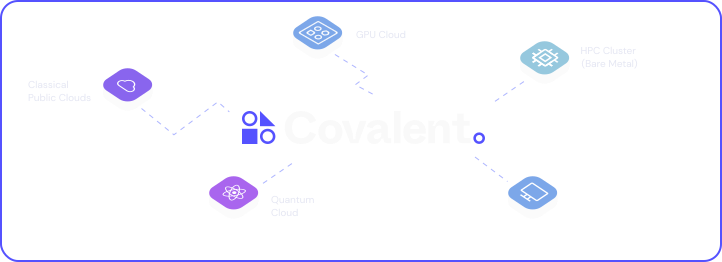
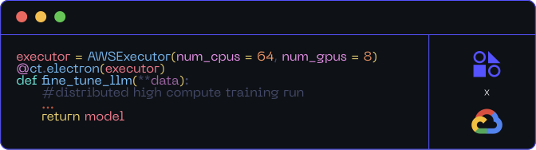
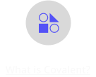

<svg fill="none" viewBox="0 0 600 300" width="600" height="300" xmlns="http://www.w3.org/2000/svg">

<foreignObject>

     

Empowering Research on Limited Resources – Quantum, HPC, GPU, Cloud

Covalent is a Pythonic workflow tool for computational scientists, AI/ML software engineers, and anyone who needs to run experiments on limited or expensive computing resources including quantum computers, HPC clusters, GPU arrays, and cloud services.

Covalent enables a researcher to run computation tasks on an advanced hardware platform – such as a quantum computer or serverless HPC cluster – using a single line of code.

<video  controls> <source src="./doc/source/_static/readme.mp4" type="video/mp4"> Your browser does not support the video tag. </video>

</img>

<pre><code> &lt;div style=&quot; 
  display:flex; 
  flex-direction:column; 
  align-items:center;
  padding:20px;
  text-align:center&quot;&gt;
   &lt;img src=&quot;./deployment.svg&quot;  alt=&quot;whatiscovalent&quot; style=&quot;width:40%&quot;/&gt;
   &lt;div style=&quot;color:#6D7CFF;
    margin:25px 0 0 0;
    font-size:14px;
    font-weight:500&quot;&gt;
    Rapid Deployment
   &lt;/div&gt;
   &lt;div style=&quot;font-size:14px;
   color:#F9F9F9&quot;&gt;Seamlessly transition from experiments to production within Covalent.
   &lt;/div&gt;
 &lt;/div&gt;
 &lt;div style=&quot; 
  display:flex; 
  flex-direction:column; 
  align-items:center;
  padding:20px;
  text-align:center&quot;&gt;
   &lt;img src=&quot;./high_compute.svg&quot;  alt=&quot;whatiscovalent&quot; style=&quot;width:40%&quot;/&gt;
   &lt;div style=&quot;color:#6D7CFF;
    margin:25px 0 0 0;
    font-size:14px;
    font-weight:500&quot;&gt;
    API for High Compute
   &lt;/div&gt;
   &lt;div style=&quot;font-size:14px;
   color:#F9F9F9&quot;&gt;Expose functions and solvers from generative AI to quantum using Covalent.
   &lt;/div&gt;
 &lt;/div&gt;
    &lt;div style=&quot; 
  display:flex; 
  flex-direction:column; 
  align-items:center;
  padding:20px;
  text-align:center&quot;&gt;
   &lt;img src=&quot;./high_compute.svg&quot;  alt=&quot;whatiscovalent&quot; style=&quot;width:40%&quot;/&gt;
   &lt;div style=&quot;color:#6D7CFF;
    margin:25px 0 0 0;
    font-size:14px;
    font-weight:500&quot;&gt;
    Intuitive Monitoring
   &lt;/div&gt;
   &lt;div style=&quot;font-size:14px;
   color:#F9F9F9&quot;&gt;Oversee workflows across clouds with real-time tracking via a user-friendly UI.
   &lt;/div&gt;
 &lt;/div&gt;
 &lt;div style=&quot; 
  display:flex; 
  flex-direction:column; 
  align-items:center;
  padding:20px;
  text-align:center&quot;&gt;
   &lt;img src=&quot;./computing.svg&quot;  alt=&quot;whatiscovalent&quot; style=&quot;width:40%&quot;/&gt;
   &lt;div style=&quot;color:#6D7CFF;
    margin:25px 0 0 0;
    font-size:14px;
    font-weight:500&quot;&gt;
    Seamless Orchestration
   &lt;/div&gt;
   &lt;div style=&quot;font-size:14px;
   color:#F9F9F9&quot;&gt;From local prototypes to multi-cloud applications, manage with ease.
   &lt;/div&gt;
 &lt;/div&gt;
  &lt;div style=&quot; 
  display:flex; 
  flex-direction:column; 
  align-items:center;
  padding:20px;
  text-align:center&quot;&gt;
   &lt;img src=&quot;./workflows.svg&quot;  alt=&quot;whatiscovalent&quot; style=&quot;width:40%&quot;/&gt;
   &lt;div style=&quot;color:#6D7CFF;
    margin:25px 0 0 0;
    font-size:14px;
    font-weight:500&quot;&gt;
    Adaptive Workflows
   &lt;/div&gt;
   &lt;div style=&quot;font-size:14px;
   color:#F9F9F9&quot;&gt;Real-time workflow adjustments with dynamic resource allocation.
   &lt;/div&gt;
 &lt;/div&gt;
  &lt;div style=&quot; 
  display:flex; 
  flex-direction:column; 
  align-items:center;
  padding:20px;
  text-align:center&quot;&gt;
   &lt;img src=&quot;./orchestration.svg&quot;  alt=&quot;whatiscovalent&quot; style=&quot;width:40%&quot;/&gt;
   &lt;div style=&quot;color:#6D7CFF;
    margin:25px 0 0 0;
    font-size:14px;
    font-weight:500&quot;&gt;
    Rapid Deployment
   &lt;/div&gt;
   &lt;div style=&quot;font-size:14px;
   color:#F9F9F9&quot;&gt;Seamlessly transition from experiments to production within Covalent.
   &lt;/div&gt;
 &lt;/div&gt;
&lt;/div&gt;</code></pre>

<pre><code>Installation</code></pre>

<pre><code>Covalent is developed using Python version 3.8 on Linux and macOS. The easiest way to install Covalent is using the PyPI package manager:
&lt;/div&gt;
&lt;div style=&quot;margin:20px 0 0 0;width:50%;border-radius:6px;background:#171B21;color:#89BEFA;padding:12px 10px;display:flex;justify-content:space-between&quot;&gt;&lt;div&gt;$ pip install covalent&lt;/div&gt;&lt;img src=&quot;./copy.svg&quot;  alt=&quot;copy&quot; style=&quot;cursor:pointer&quot;/&gt;&lt;/div&gt;</code></pre>

<pre><code>Getting Started</code></pre>

<pre><code>Ready to try it? 
Refer to the  &lt;a href=&quot;https://docs.covalent.xyz/docs/get-started/quick-start/&quot;&gt;Quick Start&lt;/a&gt;  guide for quick setup instructions, or to the &lt;a href=&quot;https://docs.covalent.xyz/docs/get-started/first-experiment/&quot;&gt;First Experiment&lt;/a&gt;  guide for a more thorough approach. For a full list of supported platforms, see the Covalent &lt;a href=&quot;https://docs.covalent.xyz/docs/user-documentation/compatibility/&quot;&gt;compatibility matrix.&lt;/a&gt; 
&lt;/div&gt;
 &lt;div style=&quot;color:#CBCBD7; font-size:14px; font-weight:400; margin:21px 0 0 0&quot;&gt;
For a more in-depth description of Covalent&#39;s features and how they work, see the &lt;a href=&quot;https://docs.covalent.xyz/docs/user-documentation/concepts/concepts-index/&quot;&gt;Concepts&lt;/a&gt; page in the documentation.
&lt;/div&gt;</code></pre>

Know More

For a more in-depth description of Covalent’s features and how they work, see the Concepts page in the documentation.

 <a href="https://www.covalent.xyz/what-is-covalent/" style="margin:20px 0 0 0">What is Covalent</a>

 <a href="https://www.covalent.xyz/navigating-the-modern-hpc-landscape/" style="margin:20px 0 0 0">Covalent in the era of cloud-HPC</a>

 <a href="https://docs.covalent.xyz/docs/user-documentation/concepts/covalent-basics/" style="margin:20px 0 0 0">Basic Concepts of Covalent</a>

 <a href="https://github.com/AgnostiqHQ/covalent/blob/develop/README.md#how-does-it-work" style="margin:20px 0 0 0">How does Covalent work?</a>

Tutorials

<pre><code>&lt;div style=&quot; padding: 10px;&quot;&gt;
 &lt;div onclick=&quot;location.href=&#39;www.google.com&#39;;&quot; style=&quot;border:1px solid #5552FF;
 border-radius:8px;
 padding:20px 10px;
 height:185px;&quot;&gt;
 &lt;img src=&quot;./mnist.svg&quot; alt=&quot;mnist&quot; style=&quot;width:100%;&quot;/&gt;
 &lt;div style=&quot;color:#FFF;font-size:16px;&quot;&gt;
  MNIST Classifier
 &lt;/div&gt;
&lt;/div&gt;
&lt;/div&gt;
 &lt;div style=&quot; padding: 10px;&quot;&gt;
 &lt;div style=&quot;border:1px solid #5552FF;
 border-radius:8px;
 padding:20px 10px;
 height:185px;&quot;&gt;
 &lt;img src=&quot;./workflow.svg&quot; alt=&quot;mnist&quot; style=&quot;width:100%&quot;/&gt;
 &lt;div style=&quot;color:#FFF;font-size:16px;&quot;&gt;
 Dynamic Quantum Chemistry Workflow
 &lt;/div&gt;
&lt;/div&gt;
&lt;/div&gt;
&lt;div style=&quot; padding: 10px;&quot;&gt;
 &lt;div style=&quot;border:1px solid #5552FF;
 border-radius:8px;
 padding:20px 10px;
 height:185px;&quot;&gt;
 &lt;img src=&quot;./workflow.svg&quot; alt=&quot;mnist&quot; style=&quot;width:100%&quot;/&gt;
 &lt;div style=&quot;color:#FFF;font-size:16px;&quot;&gt;
  Dynamic Quantum Chemistry Workflow
 &lt;/div&gt;
&lt;/div&gt;
&lt;/div&gt;
 &lt;div style=&quot; padding: 10px;&quot;&gt;
 &lt;div style=&quot;border:1px solid #5552FF;
 border-radius:8px;
 padding:20px 10px;
 height:185px;&quot;&gt;
 &lt;img src=&quot;./ai.svg&quot; alt=&quot;mnist&quot; style=&quot;width:100%&quot;/&gt;
 &lt;div style=&quot;color:#FFF;font-size:16px;&quot;&gt;
  Building Scalable API Backends with Covalent for LLM and Generative AI..
 &lt;/div&gt;
&lt;/div&gt;
&lt;/div&gt;</code></pre>

Covalent’s serverless HPC architecture allows you to easily scale jobs from your laptop to your HPC/Cloud

Contributing

To contribute to Covalent, refer to the <a href="https://github.com/AgnostiqHQ/covalent/blob/master/CONTRIBUTING.md">Contribution Guidelines</a>. We use GitHub’s <a href="https://github.com/AgnostiqHQ/covalent/issues">issue tracking</a>. to manage known issues, bugs, and pull requests. Get started by forking the develop branch and submitting a pull request with your contributions. Improvements to the documentation, including tutorials and how-to guides, are also welcome from the community. For more more information on adding tutorials, check the <a href="https://github.com/AgnostiqHQ/covalent/blob/master/doc/TUTORIAL_GUIDELINES.md">Tutorial Guidelines</a> Participation in the Covalent community is governed by the <a href="https://github.com/AgnostiqHQ/covalent/blob/master/CODE_OF_CONDUCT.md">Code of Conduct</a>.

Citation

Please use the following citation in any publications

<a href="https://zenodo.org/record/8369670"> https://doi.org/10.5281/zenodo.5903364

License

Covalent is licensed under the Apache 2.0 License. See the LICENSE file or contact the support team for more details. For a detailed history of changes and new features, see the Changelog.

<pre><code>&lt;/div&gt;</code></pre>

</foreignObject> </svg>

