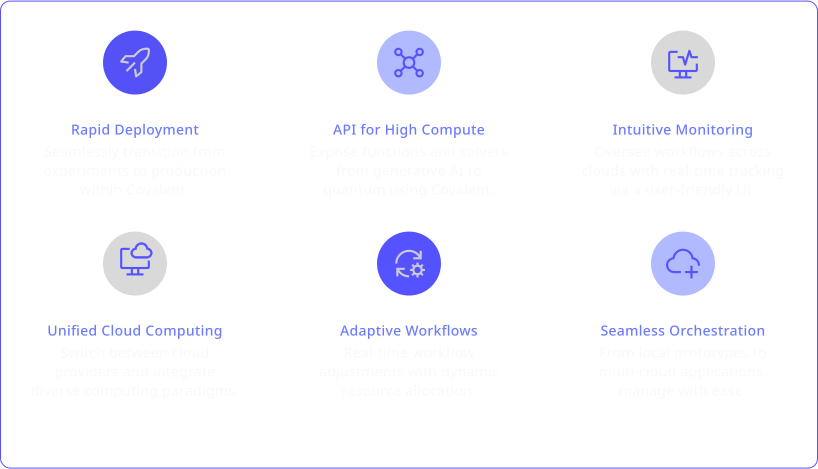

 
  
 

 

   

 

  
 

Covalent is a Pythonic workflow tool for computational scientists, AI/ML software engineers, and anyone who needs to run experiments on limited or expensive computing resources including quantum computers, HPC clusters, GPU arrays, and cloud services.

Covalent enables a researcher to run computation tasks on an advanced hardware platform – such as a quantum computer or serverless HPC cluster – using a single line of code.

  

   <video  controls>
   <source src="./readme.mp4" type="video/mp4">
  Your browser does not support the video tag.
</video> 
 

 

  </img>
 

  

  </img>
 

  

## Know More

For a more in-depth description of Covalent's features and how they work, see the Concepts page in the documentation.

<!-- 

  

 -->
