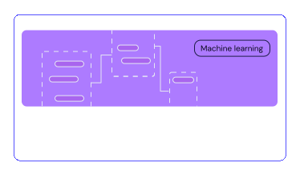

 
  
 

 <!-- 

   

 -->

 
 
 
 
 

 
 
 

 

  
 

Covalent is a Pythonic workflow tool for computational scientists, AI/ML software engineers, and anyone who needs to run experiments on limited or expensive computing resources including quantum computers, HPC clusters, GPU arrays, and cloud services.

Covalent enables a researcher to run computation tasks on an advanced hardware platform – such as a quantum computer or serverless HPC cluster – using a single line of code.

  <!-- 

   <video  controls>
   <source src="./readme.mp4" type="video/mp4">
  Your browser does not support the video tag.
</video> 
 

 -->

 <!-- 

  </img>
 
 -->

 
 
 
 
 

  

  </img>
 

<!-- 

  

 -->

| **Installation**                                                                                                                                                                                                                                                                                         | **Getting started**                                                                                                                                                                                                     |
| :------------------------------------------------------------------------------------------------------------------------------------------------------------------------------------------------------------------------------------------------------------------------------------------------------------------- | :----------------------------------------------------------------------------------------------------------------------------------------------------------------------------------------------------------------------------- |
| Covalent is developed using Python version 3.8 on Linux and macOS. The easiest way to install Covalent is using the PyPI package manager: | Ready to try it? Refer to the [Quick Start](https://docs.covalent.xyz/docs/get-started/quick-start/) guide for quick setup instructions, or to the [First Experiment](https://docs.covalent.xyz/docs/get-started/first-experiment/) guide for a more thorough approach. For a full list of supported platforms, see the Covalent [compatibility matrix](https://docs.covalent.xyz/docs/user-documentation/compatibility/). For a more in-depth description of Covalent's features and how they work, see the [Concepts](https://docs.covalent.xyz/docs/user-documentation/concepts/concepts-index/) page in the documentation. |

<!-- 

 -->

### Know More

For a more in-depth description of Covalent's features and how they work, see the Concepts page in the documentation.

 
 
 
 

### Tutorials

 
 
 

 

Covalent’s serverless HPC architecture allows you to easily scale jobs from your laptop to your HPC/Cloud

### Contributing
 <!-- 

 -->
 To contribute to Covalent, refer to the [Contribution Guidelines](https://github.com/AgnostiqHQ/covalent/blob/master/CONTRIBUTING.md). We use GitHub's [issue tracking](https://github.com/AgnostiqHQ/covalent/issues) to manage known issues, bugs, and pull requests. Get started by forking the develop branch and submitting a pull request with your contributions. Improvements to the documentation, including tutorials and how-to guides, are also welcome from the community. For more more information on adding tutorials, check the [Tutorial Guidelines](https://github.com/AgnostiqHQ/covalent/blob/master/doc/TUTORIAL_GUIDELINES.md) Participation in the Covalent community is governed by the [Code of Conduct](https://github.com/AgnostiqHQ/covalent/blob/master/CODE_OF_CONDUCT.md).

 ### Citation

 Please use the following citation in any publications

[https://doi.org/10.5281/zenodo.5903364](https://zenodo.org/records/8369670)

 ### License

 Covalent is licensed under the Apache 2.0 License. See the [LICENSE](https://github.com/AgnostiqHQ/covalent/blob/master/LICENSE) file or contact the [support team](support@aqnostic.ai) for more details. 
 
 For a detailed history of changes and new features, see the [Changelog](https://github.com/AgnostiqHQ/covalent/blob/master/CHANGELOG.md).

https://github.com/batchumanish/testing_readme/assets/126003896/8182a5c6-a919-4234-b51f-c4551f030432

### Heading
#### content

